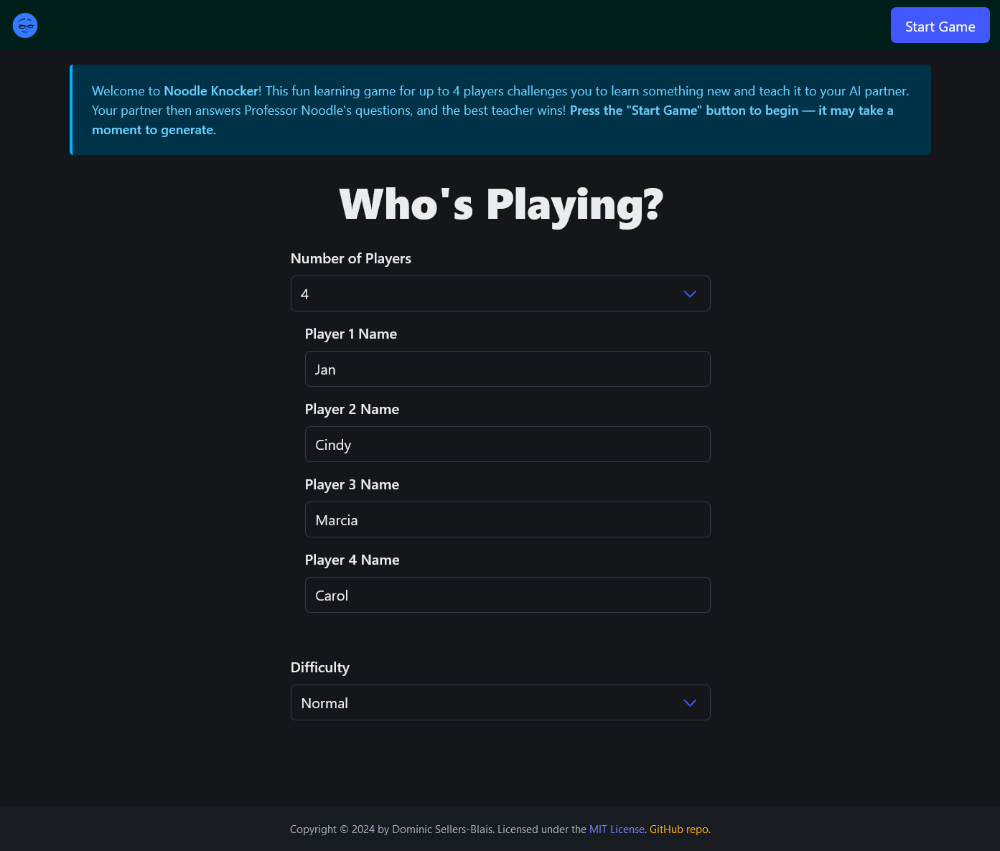
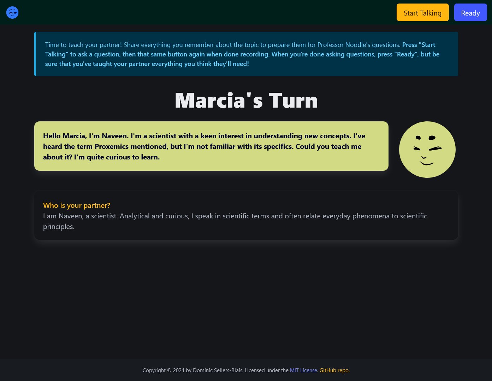
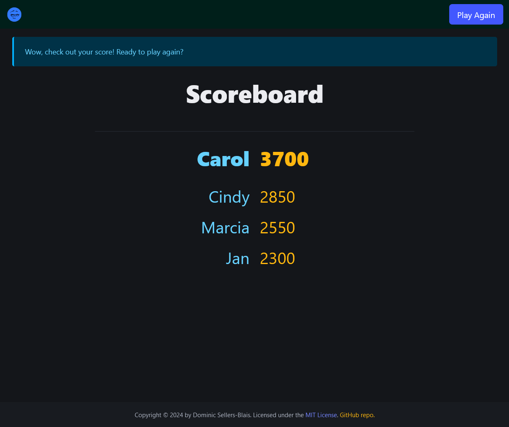

# Noodle Knocker

**Noodle Knocker** is an experimental educational game where players teach AI "partners" about a topic. Players are scored based on how well they taught their partners.

#### Try it online: [https://noodleknocker.ed2ai.workers.dev](https://noodleknocker.ed2ai.workers.dev)


## Why This Matters

The rapid advancement of generative AI is shifting the educational value from students' own labor to their directing and managing work by AI. Improving students' ability to guide AI to produce better results on their behalf is already a key skill for many students. In some cases, students are demonstrating this shift by using AI to illicitly complete their schoolwork, creating a conflict between learning goals and the development of these next generation managerial skills.

**Noodle Knocker** attempts to align learning goals with the development and practice of managerial AI skills. Additionally, **Noodle Knocker** presents what could be a very effective way for students to learn material through its learning-by-teaching approach and multimodal instruction format.

Finally, **Noodle Knocker** is also a demonstration of the potential of AI-to-AI interactions within education. In the future, it is likely that many AI services will be interfaces to AI systems comprised by many different AI models intelligently interacting with each other. Productively orchestrating models teaching, talking, evaluating, and, more broadly, using each other is a further, more advanced example of the new managerial skill that students could benefit from developing.


## How It Works

**Noodle Knocker** is designed as a Cloudflare Worker and works as an edge serverless web application. **Noodle Knocker** uses [Anthropic's Claude](https://claude.ai) LLM, a state-of-the-art LLM with excellent safety, performance, and reasoning characteristics, for all of its text-related tasks, including generating educational presentations, acting as a roleplayed conversational partner, and grading outcomes.

**Noodle Knocker** makes extensive use of voice interaction through [Deepgram](https://deepgram.com)'s text-to-speech and speech-to-text services. Deepgram provides superb performance, allowing for very natural conversational flow and, thereby, a more emotionally and intellectually convincing interaction with the app's AI personalities.

Internally, **Noodle Knocker** is written in JavaScript, has a number of "hacks" due to Cloudflare Worker's constraints, and makes extensive use of WebSockets and Cloudflare's Durable Objects persistent worker system.

## What It Looks Like

To start, set the number of players and their names:


Once the topic has been randomly chosen, the players get a short presentation by Professor Noodle:


After the presentation, players can ask Professor Noodle any questions:


Next comes the key activity: players teach their AI partners (each imbued with unique characteristics) about the topic:


Then players' AI partners take a graded quiz:


The results are shown and the game ends:


[View a short video example](docs_media/output_video.mp4).


## How To Run It

**Noodle Knocker** can be run online at [https://noodleknocker.ed2ai.workers.dev](https://noodleknocker.ed2ai.workers.dev) or as your own Cloudflare Worker project based on Noodle Knocker's [source code repository](https://github.com/DominicBlais/noodleknocker). For the later option, visit [Cloudflare's docs](https://developers.cloudflare.com/workers/) to get started with your Worker project, then add in the repository's source and install all necessary packages with `npm`.

You will need to modify your `wranger.toml` and add entries similar to the following:

```
[vars]
DEEPGRAM_PROJECT_ID = "<YOUR_PROJECT_ID>"
DEEPGRAM_API_KEY = "<YOUR_DEEPGRAM_API_KEY>"
DEEPGRAM_SPEAK_ENDPOINT = "wss://api.deepgram.com/v1/speak"
DEEPGRAM_TRANSCRIBE_ENDPOINT = "wss://api.deepgram.com/v1/listen"
ANTHROPIC_API_KEY = "<YOUR_ANTHROPIC_API_KEY>"
ANTHROPIC_MODEL = "claude-3-5-sonnet-20240620"

[[durable_objects.bindings]]
name = "NOODLE_KNOCKER_DURABLE_OBJECT"
class_name = "NoodleKnockerDurableObject"

[[migrations]]
tag = "v1"
new_classes = ["NoodleKnockerDurableObject"]

[ai]
binding = "AI"
```

Please be aware that **Noodle Knocker** is not fully compatible with Safari browsers. Safari's strict permissions require user-initiated audio playback, which interferes with **Noodle Knocker**'s WebSocket-driven intermittent audio playback.


## Credits

**Noodle Knocker** was invented and developed by Dominic Sellers-Blais. All code is original to this project and MIT licensed. **Noodle Knocker** uses the following third-party services, libraries, and assets:

- Anthropic's Claude AI: https://claude.ai
- Deepgram's TTS and STT: https://deepgram.com
- Cloudflare Workers: https://workers.cloudflare.com/
- Bulma: https://bulma.io/
- DiceBear: https://www.dicebear.com/
- Lorelei Neutral avatars by Lisa Wischofsky: https://www.instagram.com/lischi_art/
- Showdown: http://www.showdownjs.com/
- Canvas Confetti: https://www.kirilv.com/canvas-confetti/
- The following audio files:
  - https://freesound.org/people/portwain/sounds/220060/
  - https://freesound.org/people/jimhancock/sounds/256128/
  - https://github.com/anars/blank-audio/blob/master/5-seconds-of-silence.mp3

